<div align="center">



<br/>

[](https://www.python.org/)
[](https://opencv.org/)
[](https://github.com/ultralytics/ultralytics)
[](https://flask.palletsprojects.com/)
[](#license)

**Real-time multi-object detection with OpenCV + YOLOv8 — as a desktop window or a live browser stream.**

[Features](#-features) • [Demo Modes](#-run-it-two-ways) • [Setup](#-getting-started) • [Architecture](#-how-it-works) • [Training](#-model--training) • [API](#-flask-api-reference) • [FAQ](#-faq)

</div>

---

## 📌 Overview

This project detects and labels everyday objects in real time using **YOLOv8** (via [Ultralytics](https://github.com/ultralytics/ultralytics)) on top of **OpenCV**. It ships in two forms:

- a lightweight **desktop script** (`main.py`) that opens a live annotated webcam window, and
- a full **Flask web application** (`website/app.py`) with a styled control panel, live MJPEG video stream, and a JSON stats API — no desktop window required.

Out of the box it recognizes all **80 COCO classes** — people, vehicles, animals, furniture, electronics, food, and more — with bounding boxes, class labels, and confidence scores drawn on every frame.

## 🎯 Target Audience

| Who | Why it's useful |
|---|---|
| **Developers & hobbyists** | A clean starting point for building real-world CV skills |
| **Students & researchers** | A working reference for object detection pipelines |
| **Industry prototypers** | A low-cost base for automation, QC, or security proof-of-concepts |
| **Educators** | A demo-ready OpenCV + YOLO implementation for workshops |

## ✨ Features

- 🎥 Real-time detection from a live webcam feed or video stream
- 🏷️ 80-class COCO object recognition out of the box (person, car, dog, laptop, bottle, and more)
- 📦 Bounding boxes with class label + confidence score overlays
- 🌐 Optional Flask web UI — start/stop detection, live stream, and detection stats from the browser
- 📊 Custom training run included (`train/`) with logged metrics per epoch
- 🧩 Easily swappable model weights — drop in `best.pt` or a larger YOLOv8 checkpoint

## 🖥️ Run It Two Ways

<table>
<tr>
<td width="50%" valign="top">

**1. Desktop window** — `main.py`

Opens a live OpenCV window with detection boxes drawn directly on the webcam feed. Minimal, fast, good for quick local testing.

</td>
<td width="50%" valign="top">

**2. Web app** — `website/app.py`

A Flask server with a dark, card-based control panel: start/stop buttons, a live MJPEG stream, running object count, and a real-time detections list.

</td>
</tr>
</table>

## 🛠️ Tech Stack

| Layer | Technology |
|---|---|
| Language | Python 3.8+ |
| Detection model | YOLOv8 (`yolov8n.pt`) via `ultralytics` |
| Computer vision | OpenCV (`opencv-python`) |
| Overlay rendering | `cvzone` |
| Numerical ops | NumPy |
| Web server | Flask |
| Frontend | HTML / CSS / vanilla JS (MJPEG streaming) |

## 🧭 How It Works

<div align="center">

</div>

Each frame is captured, passed through YOLOv8 for inference, annotated with bounding boxes and confidence scores via `cvzone`, and then either shown in a desktop window (`main.py`) or streamed to the browser as MJPEG (`website/app.py`) alongside a JSON stats feed.

## 🚀 Getting Started

### Prerequisites
- Python 3.8 or higher
- A webcam (for live detection)

### Installation

```bash
# Clone the repository
git clone https://github.com/ComradeMohan/CSA0810PythonProgramming.git
cd "CSA0810PythonProgramming/Various Object Identification"

# Install dependencies
pip install opencv-python numpy ultralytics cvzone flask
```

### Run — desktop mode

```bash
python main.py
```

Press `q` or close the window to stop.

### Run — web app mode

```bash
cd website
python app.py
```

Then open **http://localhost:5000** in your browser and click **Start Detection**.

## 📂 Project Structure

```
Various Object Identification/
├── README.md
├── main.py                     # Standalone desktop detection script
├── images/                     # Sample / reference images
├── train/                      # Custom training run artifacts
│   ├── args.yaml               # Training configuration
│   ├── results.csv             # Per-epoch metrics
│   └── weight/
│       └── best.pt             # Best checkpoint from training
└── website/                    # Flask web application
    ├── app.py                  # Server, detection thread, streaming routes
    └── templates/
        └── index.html          # Control panel UI
```

## 🧪 Model & Training

The `train/` directory contains a sample fine-tuning run of `yolov8n.pt` on `coco8.yaml`, logged over 5 epochs.

| Config | Value |
|---|---|
| Base model | `yolov8n.pt` |
| Dataset | `coco8.yaml` |
| Epochs | 5 |
| Batch size | 16 |
| Image size | 640 |
| Optimizer | Auto |

**Final epoch results:**

| Metric | Value |
|---|---|
| Precision | 0.577 |
| Recall | 0.833 |
| mAP@50 | 0.873 |
| mAP@50–95 | 0.597 |

> This is a small demonstration run on a tiny dataset — swap in a larger, task-specific dataset and more epochs for production-grade accuracy.

## 🔌 Flask API Reference

| Route | Method | Description |
|---|---|---|
| `/` | GET | Serves the control panel UI |
| `/start` | GET | Initializes the camera and starts the detection thread |
| `/stop` | GET | Stops detection and releases the camera |
| `/video_feed` | GET | MJPEG stream of the annotated video feed |
| `/stats` | GET | JSON — current object count + last detections |
| `/classes` | GET | JSON — full list of the 80 detectable class names |

## 🔧 Optimization Ideas

- [ ] Add Canny edge detection for sharper contour recognition
- [ ] Integrate multi-object tracking (e.g. ByteTrack / BoT-SORT) across frames
- [ ] Add color-masking filters to isolate specific object types
- [ ] Swap `yolov8n.pt` for a larger variant (`s` / `m` / `l`) for higher accuracy
- [ ] Add a confidence-threshold slider to the web UI

## ❓ FAQ

**Can this detect objects in real time from a live video?**
Yes — both `main.py` and the Flask app use `cv2.VideoCapture()` for live webcam feeds.

**Does it support faces, license plates, or custom objects?**
Out of the box it detects the 80 standard COCO classes. For custom objects, fine-tune YOLOv8 on your own labeled dataset and drop the resulting weights in place of `yolov8n.pt`.

**Can I use a video file instead of a webcam?**
Yes — pass a file path to `cv2.VideoCapture()` instead of `0` in `main.py` or `app.py`.

## 📄 License

This project is available under the MIT License.

---

<div align="center">

Built by **[Comrade Mohan](https://github.com/ComradeMohan)** · [Portfolio](https://mohanreddy.me)

</div>
